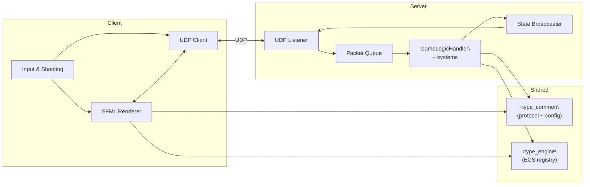
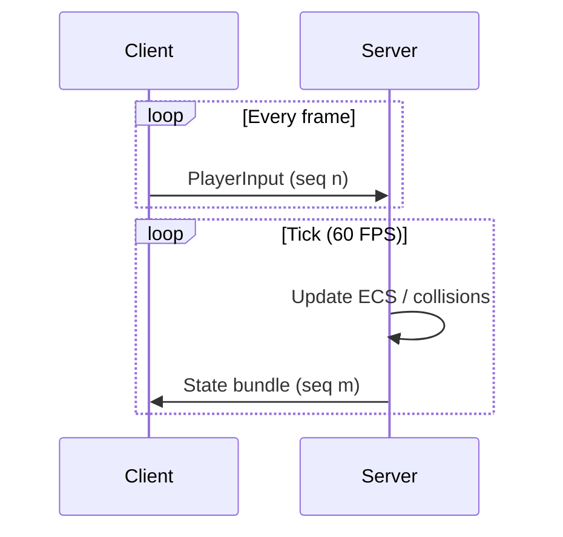
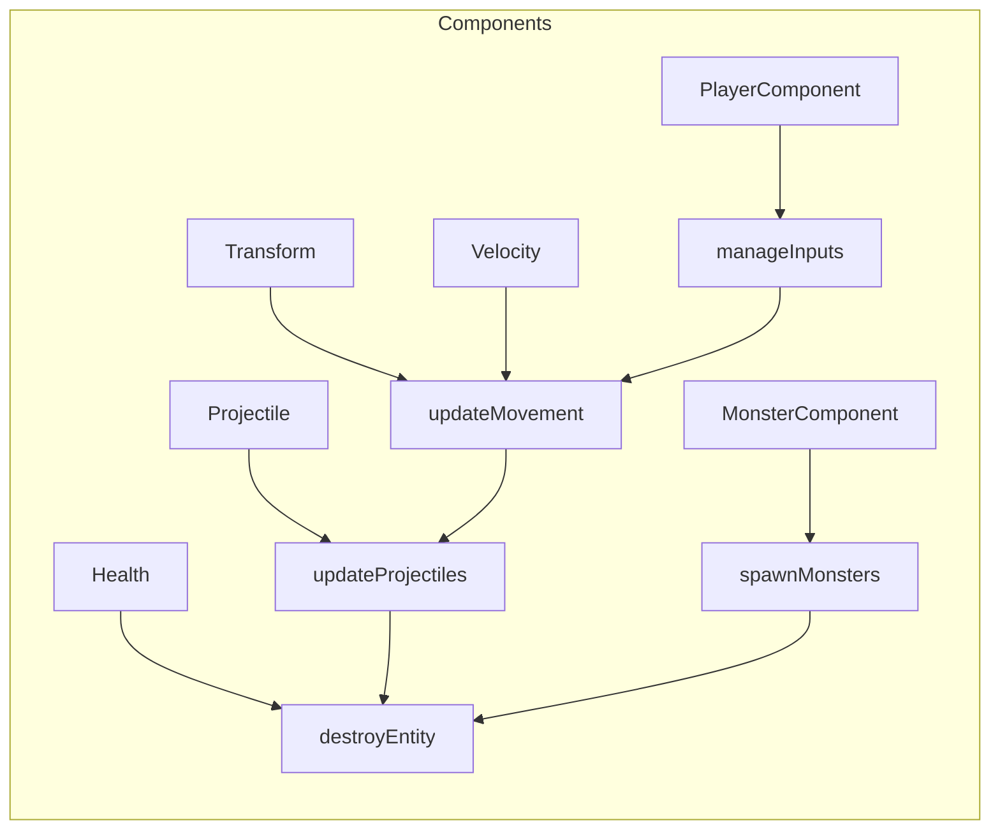

# R-Type Architecture

> **Related Documentation:**
> - [Developer Guide](developer_guide.md) — Contributing and development workflow
> - [Protocol](protocol.md) — Network protocol specification
> - [API Reference](api_reference.md) — Complete API documentation
> - [Building and Running](building_and_running.md) — Setup instructions

**Version:** 2.0  
**Last Updated:** January 2026

## Table of Contents
1. [Introduction](#introduction)
2. [Architectural Overview](#architectural-overview)
3. [Entity-Component-System (ECS)](#entity-component-system-ecs)
4. [Module Structure](#module-structure)
5. [Entity Factory Pattern](#entity-factory-pattern)
6. [Configuration System](#configuration-system)
7. [Network Architecture](#network-architecture)
8. [Threading & Synchronization](#threading--synchronization)
9. [Performance Considerations](#performance-considerations)
10. [Build & Deployment](#build--deployment-targets)

## Introduction

R-Type is a multiplayer space shooter built with a custom game engine following modern software architecture principles:

### Design Goals
- **Separation of Concerns**: Data, logic, and presentation are separated via ECS
- **Server-Authoritative**: Client handles only presentation and input
- **Configuration-Driven**: Change behavior through `.ini` files without recompilation
- **Modular Design**: Clean interfaces between modules for maintainability
- **Performance**: Data-oriented design for cache efficiency

### Key Architectural Decisions
- **Client/Server Split**: Authoritative simulation on server, thin presentation client
- **Shared Libraries**: Common data structures (`rtype_common`, `rtype_engine`) guarantee deterministic behavior
- **Binary UDP Protocol**: Efficient, lightweight networking
- **Static Linking**: Simple deployment (binaries + assets)

## Architectural Overview

### High-Level System Context

This project follows a strict client/server split with shared libraries for common code.


- Network: one UDP socket per process, serialization routines in [include/rtype/common/Protocol.hpp](include/rtype/common/Protocol.hpp).
- ECS: registry implementation plus components in [include/rtype/engine/Registry.hpp](include/rtype/engine/Registry.hpp) and [include/rtype/common/Components.hpp](include/rtype/common/Components.hpp).
- Rendering/input/audio: SFML-only code in [src/client](src/client) kept separate from gameplay logic so the server can stay headless.

## Entity-Component-System (ECS)

### What is ECS?

ECS is an architectural pattern that separates **data** from **logic** and uses **composition** instead of inheritance.

#### The Three Pillars

**1. Entities - Just IDs**
```cpp
// An entity is just a unique identifier
using EntityId = std::uint32_t;

EntityId player = 42;   // This is an entity
EntityId monster = 43;  // This is also an entity
```
**Think of entities as:** Database row IDs - they identify "things" but contain no data.

**2. Components - Pure Data**
```cpp
// Components are simple data structures with NO logic
struct Transform {
    float x{0.0f};
    float y{0.0f};
};

struct Velocity {
    float vx{0.0f};
    float vy{0.0f};
};

struct Health {
    std::uint8_t hp{3};
    bool alive{true};
};
```

**Component Rules:**
- ✅ Store data (position, health, speed)
- ❌ No methods (no `move()`, `takeDamage()`)
- ❌ No references to other entities
- ❌ No game logic

**3. Systems - Pure Logic**
```cpp
class MovementSystem : public ISystem {
public:
    void update(Registry& registry, float dt) override {
        // Process all entities with Transform + Velocity
        auto entities = registry.getEntitiesWithComponents<Transform, Velocity>();
        for (auto entity : entities) {
            auto* transform = registry.get<Transform>(entity);
            auto* velocity = registry.get<Velocity>(entity);
            transform->x += velocity->vx * dt;
            transform->y += velocity->vy * dt;
        }
    }
};
```

**System Rules:**
- ✅ Contain game logic
- ✅ Iterate over entities with specific components
- ✅ Modify component data
- ❌ Don't store state
- ❌ Don't know about specific entities

### Why ECS?

**Traditional OOP Approach (Problems):**
```cpp
class Player : public GameObject {
    void update() { /* movement, shooting, collision logic */ }
};

class Monster : public GameObject {
    void update() { /* duplicate movement, collision logic */ }
};
```
- ❌ Code duplication (movement logic in every class)
- ❌ Rigid hierarchy (hard to add new entity types)
- ❌ Poor cache performance (objects scattered in memory)

**ECS Approach (Benefits):**
```cpp
// ONE system handles ALL movement
class MovementSystem {
    void update(Registry& registry, float dt) {
        // Processes players, monsters, bullets - anything with Transform + Velocity
    }
};
```
- ✅ No code duplication
- ✅ Flexible composition (combine components freely)
- ✅ Cache-friendly (components stored contiguously)
- ✅ Easy to extend

### Registry - The Manager

The Registry manages relationships between entities and components:

```cpp
class Registry {
public:
    // Entity management
    EntityId createEntity();
    void destroyEntity(EntityId id);
    
    // Component management
    template<typename T> void emplace(EntityId id, T component);
    template<typename T> T* get(EntityId id);
    template<typename T> bool has(EntityId id);
    
    // Query entities
    template<typename... Components>
    std::vector<EntityId> getEntitiesWithComponents();
};
```

**Example: Creating a Player**
```cpp
// 1. Create entity (get an ID)
EntityId player = registry.createEntity();

// 2. Add components (attach data)
registry.emplace<Transform>(player, Transform{100.0f, 200.0f});
registry.emplace<Velocity>(player, Velocity{0.0f, 0.0f});
registry.emplace<Health>(player, Health{3, true});
registry.emplace<PlayerComponent>(player, PlayerComponent{1});

// Now entity has: Transform, Velocity, Health, PlayerComponent
```

### ECS in the Game Loop

```cpp
void gameLoop(float deltaTime) {
    // Each system processes entities with specific components
    inputSystem.update(registry, deltaTime);      // Handle player input
    movementSystem.update(registry, deltaTime);   // Update positions
    collisionSystem.update(registry, deltaTime);  // Check collisions
    boundarySystem.update(registry, deltaTime);   // Enforce bounds
    cleanupSystem.update(registry, deltaTime);    // Remove dead entities
}
```

Systems automatically work on ANY entity with matching components - no need to know if it's a player, monster, or bullet!

## Module Structure
| Module | Outputs | Depends On | Responsibilities |
| --- | --- | --- | --- |
| `rtype_common` | Static lib | Asio | Packet types, binary serializer/deserializer helpers, INI-backed configuration structs shared across binaries. |
| `rtype_engine` | Static lib | `rtype_common` | ECS registry, entity/systems pipeline utilities. |
| `rtype_server` | Executable | `rtype_engine`, `rtype_common`, Asio | Authoritative UDP server (`GameServer`, `GameLogicHandler`, `ClientHandler`) plus simulation loop and broadcast channel. |
| `rtype_client` | Executable | `rtype_engine`, `rtype_common`, Asio, SFML | Input capture, SFML renderer/audio (`GameClient`, `SFMLRender`) and snapshot interpolation helpers. |

Static linking keeps deployment simple: copying the binaries and the `assets/` directory is sufficient.

## Runtime Loops
### Authoritative Server
1. **Networking thread** (`GameServer::scheduleReceive`, [src/server/GameServer.cpp](src/server/GameServer.cpp)) runs `asio::io_context` and pushes packets into `_rxQueue` guarded by `_rxMutex`.
2. **Game thread** (`GameServer::updateGameLoop`) drains the queue every fixed tick (target 60 FPS), processes `net::PlayerInput`, and calls `GameLogicHandler::updateGame` to mutate the ECS registry.
3. After each tick, the server emits state snapshots (`PlayerState`, `MonsterState`, `BulletState`, `PowerUpState`) plus spawn/destruction events through `broadcastStates`.

All ECS operations occur on the game thread to avoid fine-grained locks. The only shared data structure between threads is the receive queue.

### Client
1. `GameClient::run` ( [src/client/GameClient.cpp](src/client/GameClient.cpp) ) loads configuration, opens the SFML window, and spawns a network receive thread.
2. The main thread polls input, builds `net::PlayerInput`, sends it via `_socket`, and drives rendering through `SFMLRender::renderFrame`.
3. The receive thread deserializes packets and updates `_players`, `_monsters`, `_bullets`, `_powerUps` under `_stateMutex`. Rendering reads copies each frame to avoid holding locks during draw calls.

## Networking Flow
- Packet format: header `{type, payloadSize, sequence, timestamp}` followed by binary payload described in [docs/protocol.md](docs/protocol.md).
- **Client → Server**: `PlayerInput` at frame rate, `DisconnectNotice` on exit.
- **Server → Client**: `PlayerAssignment` (once), recurring world snapshots, plus one-off spawn/death notifications.
- Sequencing: every sender increments `SequenceNumber`. Receivers can drop stale snapshots when interpolation is added.



## ECS Data Flow


- `GameLogicHandler` owns the registry and orchestrates systems (`manageInputs`, `managePlayerMovement`, `updateProjectiles`, `spawnMonsters`, etc.).
- Entity destruction requests are staged through `markDestroy` to delay actual removal until the end of the tick, keeping iterators stable.

## Entity Factory Pattern

### Why Factory?

Creating entities manually is repetitive and error-prone:
```cpp
// Manual creation - lots of boilerplate
EntityId player = registry.createEntity();
registry.emplace<Transform>(player, Transform{100, 200});
registry.emplace<Velocity>(player, Velocity{0, 0});
registry.emplace<Health>(player, Health{3, true});
registry.emplace<PlayerComponent>(player, PlayerComponent{1});
registry.emplace<FireCooldown>(player, FireCooldown{});
```

**Problems:**
- Code duplication
- Easy to forget components
- Hardcoded values scattered everywhere

### Factory Solution

```cpp
class EntityFactory {
public:
    EntityFactory(Registry& registry, const GameConfig& config);
    
    EntityId spawnPlayer(PlayerId id, float x, float y);
    EntityId spawnMonster(uint8_t type, float x, float y, float vx, float vy);
    EntityId spawnBullet(PlayerId owner, float x, float y, float vx, float vy);
    EntityId spawnPowerUp(uint8_t type, float x, float y, float vx, float vy);
};
```

**Usage:**
```cpp
// Before: 10+ lines of boilerplate
// After: Single line
_entityFactory.spawnPlayer(playerId, x, y);
```

**Benefits:**
- ✅ No code duplication
- ✅ Configuration-driven (values from `game.ini`)
- ✅ Easy to maintain
- ✅ Type safety
- ✅ Testable

## Configuration System

### Design Philosophy

All game parameters are loaded from `.ini` files to enable:
- Changes without recompilation
- Easy balancing and tweaking
- Runtime flexibility
- Multiple configurations for testing

### Configuration Files

**`config/game.ini`** - Game mechanics and parameters
```ini
[Gameplay]
PlayerSpeed=220.0
PlayerStartHP=3
BulletSpeed=380.0
MonsterSpawnDelay=2.0
WorldWidth=1280.0
WorldHeight=720.0

[Render]
WindowWidth=1280
WindowHeight=720
TargetFPS=60

[Network]
DefaultPort=5000
DefaultHost=127.0.0.1
MaxPlayers=4
```

**`config/systems.ini`** - System toggles
```ini
[Systems]
MovementSystem=true
CollisionSystem=true
BoundarySystem=true
# ... more systems
```

### Configuration Loading

```cpp
struct GameplayConfig {
    float playerSpeed{220.0f};
    uint8_t playerStartHP{3};
    float bulletSpeed{380.0f};
    // ... all gameplay parameters
};

struct GameConfig {
    GameplayConfig gameplay;
    RenderConfig render;
    NetworkConfig network;
    
    static GameConfig loadFromFile(const std::string& filename);
};
```

Systems are dynamically loaded based on configuration:
```cpp
void GameLogicHandler::initializeSystems() {
    if (_config.systems.movementSystem) {
        _systemPipeline.addSystem(std::make_unique<MovementSystem>());
    }
    if (_config.systems.collisionSystem) {
        _systemPipeline.addSystem(std::make_unique<CollisionSystem>(_config));
    }
    // ... load other systems
}
```

## Network Architecture

### Protocol Design

Binary UDP protocol for efficiency:
```cpp
struct PacketHeader {
    uint16_t type;           // Packet type identifier
    uint16_t payloadSize;    // Payload size in bytes
    uint32_t sequence;       // Sequence number
    uint32_t timestamp;      // Timestamp in milliseconds
};
```

See [protocol.md](protocol.md) for complete packet specifications.

## Threading & Synchronization
- **Server**: two threads (network + simulation). `_rxMutex` protects the pending packet vector. Broadcasting happens directly on the game thread since `send_to` is inexpensive at the small packet rate.
- **Client**: two threads (SFML/UI + network). `_stateMutex` protects replicated maps. Audio playback uses SFML’s internal mixer and is triggered on the main thread only.
- **Shared libraries** (`rtype_common`, `rtype_engine`) are thread-agnostic; consumers enforce their own locking strategy.

## Performance Considerations

### ECS Performance Benefits

**1. Cache-Friendly Memory Layout**
```cpp
// Traditional OOP: objects scattered in memory
Player* players[100];  // Pointers to different memory locations
// ❌ Cache misses when iterating

// ECS: components stored contiguously
std::vector<Transform> transforms;  // All transforms together
std::vector<Velocity> velocities;   // All velocities together
// ✅ Cache-friendly iteration, CPU can prefetch
```

**2. Data-Oriented Processing**
```cpp
// Process 1000 entities efficiently
for (auto entity : entitiesWithVelocity) {
    transform.x += velocity.vx * dt;  // Simple array access
    transform.y += velocity.vy * dt;  // CPU can vectorize this
}
```

**3. Skip Irrelevant Entities**
```cpp
// Only process entities with needed components
// Automatically skips entities without movement
auto moving = registry.getEntitiesWithComponents<Transform, Velocity>();
```

### Network Optimization

- **Binary Protocol**: Compact representation (not JSON/XML)
- **UDP**: Low latency, no connection overhead
- **Small Packets**: Typically < 100 bytes per packet
- **Future**: Delta compression for frequently updated values

### Rendering Optimization

- **Separate Render Thread**: Network updates don't block rendering
- **Copy State Once**: Single mutex lock per frame
- **Sprite Batching**: Group similar entities (future optimization)
- **Frustum Culling**: Don't render off-screen entities (future optimization)

## Detailed System Descriptions

For complete understanding of how systems work, see the [Core Modules section in ARCHITECTURE.md](ARCHITECTURE.md#core-modules) which includes:
- Detailed system implementations (MovementSystem, CollisionSystem, etc.)
- Component storage architecture
- System pipeline orchestration
- Monster spawning and wave progression mechanics

## Dependency Abstraction

The project uses abstract interfaces to decouple game logic from external libraries (ASIO, SFML).

### Network Abstraction (`INetwork.hpp`)

```cpp
// Abstract interfaces - no ASIO types
class IEndpoint { /* address representation */ };
class ISocket { /* send/receive operations */ };
class IIOContext { /* event loop */ };

// Concrete implementation (hidden)
class AsioEndpoint : public IEndpoint { /* ASIO internals */ };
class AsioUdpSocket : public ISocket { /* ASIO socket */ };
```

**Benefits:**
- Can replace ASIO with ENet/ZeroMQ by changing factory
- Easy to mock for testing
- Game code stays library-agnostic

### Rendering Abstraction (`IRender.hpp`)

```cpp
// Custom types (not SFML-specific)
struct Vector2 { float x, y; };
struct Color { uint8_t r, g, b, a; };

// Abstract interface
class IRender {
    virtual void drawCircle(const Vector2& pos, float radius, const Color& color) = 0;
    virtual void drawRectangle(/* ... */) = 0;
    // ... minimal rendering API
};

// SFML implementation (hidden)
class SFMLRenderer : public IRender {
    sf::RenderWindow window;  // Internal SFML dependency
    // Converts our types to SFML types
};
```

**Benefits:**
- Can swap SFML for SDL2/Raylib easily
- Headless renderer for tests
- Platform-independent game code

**Dependency Graph:**
```
Game Code → Abstract Interfaces → Concrete Implementations → External Libraries
(Server/Client) → (INetwork/IRender) → (ASIO/SFML) → (asio/sfml)
```

## Game Flow

### Server Lifecycle

**1. Initialization**
```
Load Config → Create Registry → Load Systems → Initialize Network → Start Loop
```

**2. Game Loop (60 FPS)**
```cpp
while (running) {
    // 1. Process incoming packets
    ioContext->poll();
    
    // 2. Update all systems
    systemPipeline.update(deltaTime, registry);
    
    // 3. Broadcast state to clients
    broadcastGameState();
    
    // 4. Maintain 60 FPS
    sleep(16ms);
}
```

**3. Systems Execute in Order:**
- InputSystem → Process player commands
- MovementSystem → Update positions
- FireCooldownSystem → Update weapon cooldowns
- CollisionSystem → Detect hits
- BoundarySystem → Enforce world bounds
- CleanupSystem → Remove dead entities
- LevelSystem → Manage wave progression

### Client Lifecycle

**1. Initialization**
```
Load Config → Create Renderer → Initialize Network → Connect to Server → Wait for Assignment
```

**2. Game Loop (60 FPS)**
```cpp
while (renderer->isOpen()) {
    // 1. Handle window events
    pollEvents();
    
    // 2. Send player input
    sendPlayerInput();
    
    // 3. Receive state updates
    ioContext->poll();
    
    // 4. Render game state
    drawBackground();
    drawEntities();
    drawUI();
    renderer->display();
    
    // 5. Maintain 60 FPS
    sleep(16ms);
}
```

### Entity Lifecycle

```
Spawn → Active → Mark for Destruction → Cleanup

1. Spawn: EntityFactory creates entity with components
2. Active: Systems process entity each frame
3. Mark: System sets alive=false or calls markDestroy()
4. Cleanup: CleanupSystem removes entity at end of frame
```

## How to Extend the Engine

### Adding a New Component

```cpp
// 1. Define in Components.hpp
struct Shield {
    uint8_t strength{5};
    float regenRate{1.0f};
    bool active{true};
};

// 2. Use in EntityFactory
EntityId EntityFactory::spawnShieldedPlayer(/* ... */) {
    auto entity = spawnPlayer(/* ... */);
    registry.emplace<Shield>(entity, Shield{});
    return entity;
}

// 3. Create system if needed
class ShieldRechargeSystem : public ISystem {
    void update(Registry& registry, float dt) override {
        for (auto entity : registry.getEntitiesWithComponents<Shield>()) {
            auto& shield = registry.get<Shield>(entity);
            if (!shield.active) continue;
            shield.strength = std::min(shield.strength + shield.regenRate * dt, 100.0f);
        }
    }
};

// 4. Add to configuration
[Systems]
ShieldRechargeSystem=true
```

### Adding a New System

```cpp
// 1. Implement ISystem
class GravitySystem : public ISystem {
public:
    GravitySystem(float gravity = 9.8f) : _gravity(gravity) {}
    
    void update(Registry& registry, float dt) override {
        for (auto entity : registry.getEntitiesWithComponents<Velocity>()) {
            auto& vel = registry.get<Velocity>(entity);
            vel.vy += _gravity * dt;  // Apply gravity
        }
    }
private:
    float _gravity;
};

// 2. Add to systems.ini
[Systems]
GravitySystem=true

[SystemParameters]
Gravity=9.8

// 3. Load in GameLogicHandler
if (_config.systems.gravitySystem) {
    _systemPipeline.addSystem(
        std::make_unique<GravitySystem>(_config.gameplay.gravity)
    );
}
```

### Adding a New Entity Type

```cpp
// 1. Optional: Add component
struct BossComponent {
    uint8_t phase{1};
    string attackPattern{"spiral"};
};

// 2. Add to EntityFactory
EntityId EntityFactory::spawnBoss(uint8_t type, float x, float y) {
    auto entity = _registry.createEntity();
    _registry.emplace<Transform>(entity, Transform{x, y});
    _registry.emplace<Velocity>(entity, Velocity{-50, 0});
    _registry.emplace<Health>(entity, Health{100, true});
    _registry.emplace<BossComponent>(entity, BossComponent{});
    return entity;
}

// 3. Systems automatically handle it!
// - MovementSystem moves it (has Transform+Velocity)
// - CollisionSystem detects hits (has Transform+Health)
// - BoundarySystem keeps it in bounds (has Transform)
```

### Adding a New Packet Type

See [protocol.md](protocol.md) and [developer_guide.md](developer_guide.md#adding-new-packet-types) for detailed instructions.

## Testing Strategies

### Unit Testing Components
```cpp
TEST(ComponentTest, TransformInitialization) {
    Transform t{100.0f, 200.0f};
    EXPECT_EQ(t.x, 100.0f);
    EXPECT_EQ(t.y, 200.0f);
}
```

### Unit Testing Systems
```cpp
TEST(MovementSystemTest, UpdatesPosition) {
    Registry registry;
    auto entity = registry.createEntity();
    registry.emplace<Transform>(entity, Transform{0, 0});
    registry.emplace<Velocity>(entity, Velocity{10, 0});
    
    MovementSystem system;
    system.update(registry, 1.0f);  // 1 second
    
    auto* transform = registry.get<Transform>(entity);
    EXPECT_EQ(transform->x, 10.0f);  // Moved 10 pixels
}
```

### Integration Testing
```cpp
TEST(GameLogicTest, BulletHitsMonster) {
    GameLogicHandler logic(config);
    
    // Spawn monster
    auto monster = logic.spawnMonster(0, 100, 100);
    auto monsterHealth = logic.getHealth(monster);
    EXPECT_EQ(monsterHealth, 3);
    
    // Spawn bullet at same position
    auto bullet = logic.spawnBullet(0, 100, 100);
    
    // Update (collision should occur)
    logic.update(0.016f);
    
    // Monster should have lost HP
    monsterHealth = logic.getHealth(monster);
    EXPECT_EQ(monsterHealth, 2);
}
```

### Mock Testing (Network)
```cpp
class MockSocket : public ISocket {
public:
    std::vector<std::vector<uint8_t>> sentPackets;
    
    void sendTo(std::span<const uint8_t> data, const IEndpoint& endpoint) override {
        sentPackets.push_back(std::vector<uint8_t>(data.begin(), data.end()));
    }
};

TEST(ServerTest, BroadcastsGameState) {
    auto mockSocket = std::make_unique<MockSocket>();
    GameServer server(std::move(mockSocket));
    
    // ... setup and run
    
    EXPECT_EQ(mockSocket->sentPackets.size(), 4);  // 4 clients
}
```

## Build & Deployment Targets
| Target | Binary | Notes |
| --- | --- | --- |
| `rtype_server` | `bin/rtype_server` | Headless target. Copy alongside `config/game.ini`. No asset dependency. |
| `rtype_client` | `bin/rtype_client` | Requires `assets/` directory (copied post-build) and SFML runtime libraries. |
| `rtype_engine` | `librtype_engine.a` | Internal static library; useful if you embed the ECS elsewhere. |
| `rtype_common` | `librtype_common.a` | Houses protocol/config logic for reuse in tooling or integration tests.

For distributed play, run the server on a reachable host/port, update `Network.DefaultHost` on each client, and forward the UDP port through your firewall/router. Latency requirements are modest (<50 ms ideal) thanks to the lightweight payloads.

