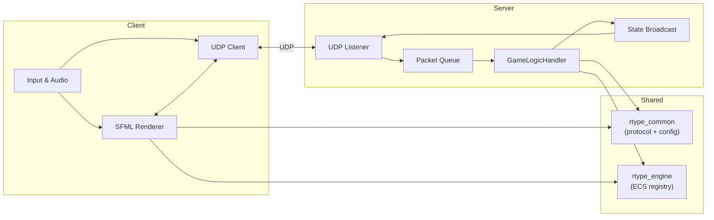

# Architecture

The project follows a strict split between an authoritative simulation server and a thin rendering client. Both binaries share components, protocol types, and configuration code via static libraries.

> **📖 For comprehensive architecture details** including game flow, testing strategies, dependency abstraction patterns, and implementation deep-dives, see [architecture.md](../architecture.md) in the main docs (consolidated from 2000+ lines of technical documentation).

## System Context

## Module Responsibilities
| Module | Description |
| --- | --- |
| `rtype_common` | Binary protocol serialization helpers, config loader, shared component data. |
| `rtype_engine` | Minimal ECS registry with `createEntity`, `emplace`, `each`, plus a simple system pipeline. |
| `rtype_server` | UDP socket lifecycle, packet queue, gameplay systems (`GameLogicHandler`), authoritative tick loop, state broadcasting. |
| `rtype_client` | SFML window management, sprite/audio loading, replicated entity maps, per-frame input sending. |

## Runtime Loops
### Server (Authoritative)
1. `asio::io_context` runs on a network thread and pushes received packets into `_rxQueue`.
2. A dedicated game thread consumes `_rxQueue` every fixed tick (target 60 FPS).
3. `GameLogicHandler` mutates the ECS (movement, projectiles, spawn/despawn) and records destruction requests.
4. `broadcastStates` serializes player/monster/bullet/power-up snapshots and sends them to each client.

### Client (Presentation)
1. Main thread drives the SFML window, polls input, and calls `sendInput` once per frame.
2. A background network thread deserializes packets and updates replicated maps guarded by `_stateMutex`.
3. `SFMLRender::renderFrame` draws the starfield, sprites, and fallback shapes; every 60 frames it logs entity counts.

## Threading Notes
- Server: two threads (network + simulation) share only the pending packet queue guarded by `_rxMutex`.
- Client: two threads (render/input + network) share replicated state via `_stateMutex`.
- Shared libs stay thread-agnostic so they can be reused in tooling without hidden locks.

## Build Targets
| Target | Output | Notes |
| --- | --- | --- |
| `rtype_server` | `bin/rtype_server` | Headless, no asset dependency. |
| `rtype_client` | `bin/rtype_client` | Requires `assets/` directory (copied post-build) and SFML runtimes. |
| `rtype_engine` | `librtype_engine.a` | ECS reusable by other tools. |
| `rtype_common` | `librtype_common.a` | Protocol/config logic for shared integrations. |

## Related Documentation
- [[Modules and API]] - Class-level API reference
- [[Networking]] - Protocol specifications  
- [architecture.md](../architecture.md) - Comprehensive implementation patterns and testing strategies (2000+ lines)
- [developer_guide.md](../developer_guide.md) - Development setup and contribution guidelines
